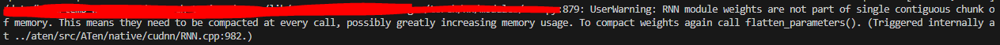

# pytorch-trainer

torch 2.0 and cpu, ddp, deepspeed trainer template

I'm thinking of making a template that is somewhat enforced.
Torch-fabric doesn't support as many features as I thought it would.
Write my own trainer in pure native torch.

Each trainer will be written in its own python file.

>   torch >= 2.1.2</br>
>   cuda 11.8</br>
>   I am experimenting with codebase deepspeed as of 231230.

deepspeed install is,

```bash
curl --proto '=https' --tlsv1.2 -sSf https://sh.rustup.rs | sh
```

After executing the command, **restart the terminal** to install deepspeed.

**Make sure you have 11.8 CUDA and the corresponding TORCH installed,**

```bash
sh scripts/install_deepspeed.sh
```

to install deepspeed.

In `vs_code_launch_json`, upload `launch.json` for debugging vscode.

## Usage

1.   Download raw data and input dir `raw_data`
2.   Copy Model Network(just `nn.Module`) in `networks` dir
3.   make `preprocess.py` and preprocess yourself
4.   if you have to make dataset, check `np_dataset.py` or `pd_dataset.py` and change
5.   if you have to make sampler, check `custom_sampler.py`
     -   i make some useful sampler in `custom_sampler.py` already (reference HF's transformers)
     -   DistributedBucketSampler : make random batch, but lengths same as possible.
     -   LengthGroupedSampler : descending order by `length` column, and select random indices batch. (dynamic batching)
     -   DistributedLengthGroupedSampler: distributed dynamic batching
6.   change `[cpu|ddp|deepspeed]_train.py`
     -   make to dataset, dataloader, etc
     -   **learning rate scheduler must be `{"scheduler": scheduler, "interval": "step", "frequency": 1, "monitor": None}`**
     -   `frequency` is step accumulation, if is 2, for every 2 train steps, take 1 scheduler step.
     -   `monitor` is for only `ReduceLROnPlateau`'s loss value
7.   I'm used dict inplace very much. so, use `chk_addr_dict` for compare dict addr. if it is difference, it causes unexpected results. 
8. `cd {your-workpsace}/pytorch-trainer` & `sh scripts/run_train_[cpu|ddp|deepseed].sh`
# TODO LIST

each test wandb is here [Link](https://wandb.ai/bart_tadev/torch-trainer?workspace=user-bart_tadev)

-   [x] cpu_trainer - lstm example, but it training is weird
-   [x] cpu_trainer - wandb
-   [x] cpu_trainer - continuous learning
-   [x] cpu_trainer - weird lstm training fix
-   [x] ddp_trainer - lstm or mnist example
-   [x] ddp_trainer - sampler and dataloader
-   [x] ddp_trainer - training loop additional process?(for distributed learning)
-   [x] ddp_trainer - Reliable wandb logging for distributed learning
-   [x] ddp_trainer - wandb have to using gather or something?
-   [x] ddp_trainer - add fp16 and bf16 use
-   [x] deepspeed_trainer - lstm or mnist example
-   [x] deepspeed_trainer - sampler and dataloader
-   [x] deepspeed_trainer - training loop additional process?(for distributed learning)
-   [x] deepspeed_trainer - wandb have to using gather or something?
-   [x] deepspeed_trainer - Reliable wandb logging for distributed learning
-   [ ] fsdp_trainer - change deepspeed to fsdp
-   [ ] fsdp_trainer - test
-   [ ] inference - ipynb, py3
-   [ ] huggingface - float16 model is real model dtype is float16? check and applied

# Deepspeed ZeRO Test result (lstm1: n_layer, lstem2: n_layer each 1000)
The `ZeRO` test is not accurate because the model was run with an lstm.

Since the LSTM requires contiguous parameters to be fully guaranteed, the partitioning may not have worked well.



Also, I have some doubts about the CPU offload performance because I used TORCH OPTIMIZED ADAMW, not DEEPSPEED OPTIMIZED ADAMW.


However, I will share the results of what I did with 2 lstm layers set to 1000 n_layer.

RTX3090 GPU Mem (Mib)
zero2 not offload: 2016
zero2 optim offload: 1964
---------------------------
zero3 full offload: 2044
zero3 optim offload: 2010
zeor3 param offload: 2044
zero3 not offload: 2054

I think, optim offload is good but, param offload is strange...

# Unsupported list

**tensorboard** - I personally find it too inconvenient.

# Gradient Checkpointing is implemented in nn.Module network!! so, I can not make any process...
useful link: https://github.com/prigoyal/pytorch_memonger/blob/master/tutorial/Checkpointing_for_PyTorch_models.ipynb

# plz help!!!

I don't have much understanding of distirbuted learning, so I'm looking for someone to help me out, PRs are always welcome.

Bugfixes and improvements are always welcome.

**If you can recommend any accelerator related blogs or videos for me to study, I would be grateful. (in issue or someting)**

# Special Thanks!
[@jp1924](https://github.com/jp1924) [@ddobokki](https://github.com/ddobokki) [@Master_yang](https://github.com/effortprogrammer)