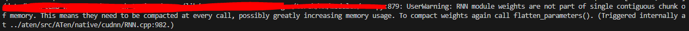
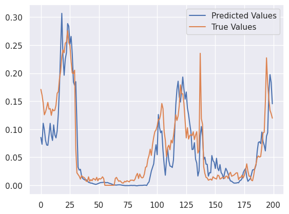
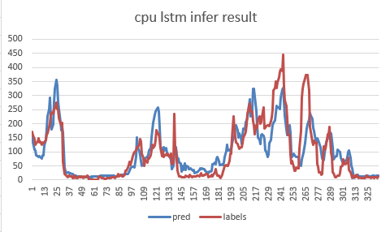
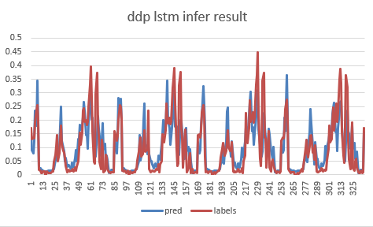
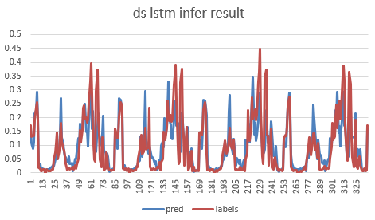
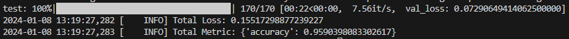

# pytorch-trainer (The best of both worlds, HuggingFace and Torch-Lightning.)
For each of the CPU, DDP, FSDP, and DS files, we have organized the various examples independently.

Use these examples as a guide to write your own train.py!

I'm thinking of making a template that is somewhat enforced.
Torch-fabric doesn't support as many features as I thought it would.
Write my own trainer in pure native torch.

Each trainer will be written in its own python file.

>   torch >= 2.1.2</br>
>   cuda 11.8</br>
>   I am experimenting with codebase deepspeed as of 231230.

deepspeed install is,

```bash
curl --proto '=https' --tlsv1.2 -sSf https://sh.rustup.rs | sh
```

After executing the command, **restart the terminal** to install deepspeed.

**Make sure you have 11.8 CUDA and the corresponding TORCH installed,**

```bash
sh scripts/install_deepspeed.sh
```

to install deepspeed.

In `vs_code_launch_json`, upload `launch.json` for debugging vscode.

## Usage

1.   Download raw data and input dir `raw_data`
2.   Copy Model Network(just `nn.Module`) in `networks` dir
3.   make `preprocess.py` and preprocess yourself
4.   if you have to make or copy `dataset`, input `utils/data/` and check some sample
5.   if you have to make or `sampler, loader`, input `utils/data` and check some sample
     -   i make some useful sampler in `custom_sampler.py` already (reference HF's transformers)
     -   DistributedBucketSampler : make random batch, but lengths same as possible.
     -   LengthGroupedSampler : descending order by `length` column, and select random indices batch. (dynamic batching)
     -   DistributedLengthGroupedSampler: distributed dynamic batching
6.   change `[cpu|ddp|deepspeed]_train.py`
     1.   Defines the `Trainer` inheritance, which is already implemented.
          Since the training pipeline may vary from model to model and dataset to dataset, we've used `@abstractmethod` to give <u>you direct control</u>, and if you need to implement additional inheritance, we've made it easy to do so by ripping out the parts you need and referencing them.
     2.   Basically, you can modify the `training_step` and `eval_loop`, which require a loss operation, and do whatever you want to accomplish, utilizing `batches`, `labels`, `criterion`, and `eval_metric`.
          I was implemented examples for using `all_gather` and more in each of the `ddp`,`deepspeed`,`fsdp` examples, so check them out and write your own code effectively!
     3.   I've implemented `chk_addr_dict`, which makes heavy use of the `dictionary inplace function`, to reference address values during `debug`. Always be careful that your own implementations don't run out of memory with each other!
7.   In the `main` function, you'll do some simple operations on the `data` at the beginning and prepare the ingredients for your `model`, `optimizer`, and `scheduler`. 
     -   **learning rate scheduler must be `{"scheduler": scheduler, "interval": "step", "frequency": 1, "monitor": None}`**
     -   `frequency` is step accumulation, if is 2, for every 2 train steps, take 1 scheduler step.
     -   `monitor` is for only `ReduceLROnPlateau`'s loss value
8.   run! `cd {your-workpsace}/pytorch-trainer` & `sh scripts/run_train_[cpu|ddp|deepseed].sh`

<details>
<summary>>>>> TODO LIST Open/Close</summary>

# TODO LIST
each test wandb is here [Link](https://wandb.ai/bart_tadev/torch-trainer?workspace=user-bart_tadev)

-   [x] cpu_trainer - lstm example, but it training is weird
-   [x] cpu_trainer - wandb
-   [x] cpu_trainer - continuous learning
-   [x] cpu_trainer - weird lstm training fix
-   [x] ddp_trainer - lstm or mnist example
-   [x] ddp_trainer - sampler and dataloader
-   [x] ddp_trainer - training loop additional process?(for distributed learning)
-   [x] ddp_trainer - Reliable wandb logging for distributed learning
-   [x] ddp_trainer - wandb have to using gather or something?
-   [x] ddp_trainer - add fp16 and bf16 use
-   [x] deepspeed_trainer - lstm or mnist example
-   [x] deepspeed_trainer - sampler and dataloader
-   [x] deepspeed_trainer - training loop additional process?(for distributed learning)
-   [x] deepspeed_trainer - wandb have to using gather or something?
-   [x] deepspeed_trainer - Reliable wandb logging for distributed learning
-   [x] fsdp_trainer - change deepspeed to fsdp
-   [x] fsdp_trainer - test (wandb compare this [link](https://medium.com/nlplanet/bert-finetuning-with-hugging-face-and-training-visualizations-with-tensorboard-46368a57fc97))
-   [x] eval epoch end all_gather on cpu, eval on cpu (?)
-   [x] Implement customizable training and eval step inheritance
-   [x] inference - py3
-   [x] huggingface - float16 model is real model dtype is float16? check and applied
    -   [x] In Huggingface `transformers`, when training a `float16` or `bfloat16` model, it is actually trained by changing the model's `dtype`,
        so if you want to reproduce this, change it via `model.to(dtype)`.
</details>

# Deepspeed ZeRO Test result (lstm1: n_layer, lstem2: n_layer each 1000)

The `ZeRO` test is not accurate because the model was run with an lstm.

Since the LSTM requires contiguous parameters to be fully guaranteed, the partitioning(cpu-gpu) may not have worked well.



Also, I have some doubts about the CPU offload performance because I used TORCH OPTIMIZED ADAMW, not DEEPSPEED OPTIMIZED ADAMW.


However, I will share the results of what I did with 2 lstm layers set to 1000 n_layer.

| test set            | RTX3090 GPU Mem (Mib) |
| ------------------- | --------------------- |
| zero2 optim offload | 2016                  |
| zero2 optim offload | 1964                  |
| zero3 full offload  | 2044                  |
| zero3 optim offload | 2010                  |
| zeor3 param offload | 2044                  |
| zero3 not offload   | 2054                  |

I think, optim offload is good but, param offload is strange...

# Infer Result
>   `distributed learning` will shuffle the data for each GPU <br />
>   so you won't be able to find the source specified here up to scaler. <br />

**Time Series Task**
| category            | image                                                        |
| ------------------- | ------------------------------------------------------------ |
| label               |  |
| CPU                 |      |
| DDP                 |      |
| DeepSpeed           |        |

**IMDB (Binary Classification) Task**
| category            | image                                                        |
| ------------------- | ------------------------------------------------------------ |
| FSDP                |          |

# Unsupported list

**tensorboard** - I personally find it too inconvenient.

# Gradient Checkpointing is implemented in nn.Module network!! so, I can not make any process...

useful link: https://github.com/prigoyal/pytorch_memonger/blob/master/tutorial/Checkpointing_for_PyTorch_models.ipynb

# plz help!!!

I don't have much understanding of distirbuted learning, so I'm looking for someone to help me out, PRs are always welcome.

Bugfixes and improvements are always welcome.

**If you can recommend any accelerator related blogs or videos for me to study, I would be grateful. (in issue or someting)**

# Special Thanks!

[@jp1924](https://github.com/jp1924) [@ddobokki](https://github.com/ddobokki) [@Master_yang](https://github.com/effortprogrammer)
